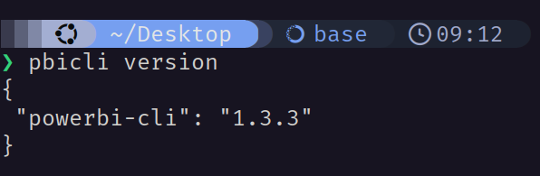
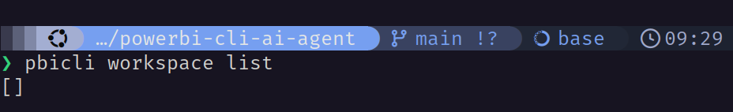

# powerbi-cli-ai-agent
AI Agent that utilizes Power BI CLI


# Installation

**Step 1**: You'll need to download NodeJS first via https://nodejs.org/en/download/

**Step 2**: Install Power BI CLI:

```
npm i -g @powerbi-cli/powerbi-cli
```

Verify with:

```
pbicli version
```



**Step 3**: Install Azure CLI:

On Debian/Ubuntu:
```
curl -fsSL 'https://azurecliprod.blob.core.windows.net/$root/deb_install.sh' | sudo bash
```

On MacOS:
```
brew update && brew install azure-cli
```

On Windows:
```
winget install --exact --id Microsoft.AzureCLI
```

# Get Started

Log in with Azure CLI:

```
az login
```

*Note*: If you encounter this error:
```
The following tenants don't contain accessible subscriptions. Use `az login --allow-no-subscriptions` to have tenant level access.
```

Then you'll need to log in at the teant level with `az login --allow-no-subscriptions`

After successful authentication, run:

```
pbicli login --azurecli
```

Verify with:

```
pbicli workspace list
```
If it successfully retrieves a list of workspaces (or returns an empty list  []  instead of an authentication/login error), your integration is fully authorized and ready.



# Running the Web Application Locally

To run the AI Agent's dashboard and chat interface locally:

**Step 1**: Install project dependencies:
```bash
npm install
```

**Step 2**: Configure environment variables:
Create a `.env.local` file by copying the template:
```bash
cp .env.example .env.local
```
Then, update `.env.local` with your LLM configuration (such as your OpenAI API Key or compatible provider endpoint).

**Step 3**: Start the Next.js development server:
```bash
npm run dev
```

Open [http://localhost:3000](http://localhost:3000) in your browser.

# Developer Notes & CLI Bug Workarounds

During implementation, we identified and solved critical limitations and bugs in the underlying `@powerbi-cli/powerbi-cli` package:

### 1. The Dataset Query Command Bug (Silent Failure)
* **Problem**: Executing `pbicli dataset query --dax "..."` without specifying a script option (either `--script` or `--script-file`) causes `powerbi-cli` to construct a file-path string `"@undefined"`. This triggers `fs.readFileSync` on a file named `undefined`, throwing a native `ENOENT` error. Because of a bug in the CLI's error handler wrapper, this error gets swallowed, and the CLI exits silently with code `0` and empty results.
* **Solution**: The application backend automatically intercepts `pbicli dataset query` commands and appends a dummy `--script "{}"` parameter. This bypasses the buggy file path parser and executes the query correctly.

### 2. DAX Query Formatting & JSON String Interpolation
* **Problem**: The CLI interpolates DAX queries directly into JSON requests without escaping. Newlines or double quotes in the DAX statement break the JSON format, causing 400 errors or execution failures.
* **Solution**: The application sanitizes queries before command dispatch, replacing newlines/multiple spaces with a single space and normalizing double quotes to single quotes.

### 3. Workspace Naming Convention for "My workspace"
* **Problem**: Passing `--workspace "My workspace"` to `pbicli` commands fails because the CLI expects the personal sandbox workspace option to be omitted entirely. Passing it explicitly throws a `No workspace found` error.
* **Solution**: The AI agent is instructed to omit the `--workspace` flag when targeting the user's personal sandbox ("My workspace").

